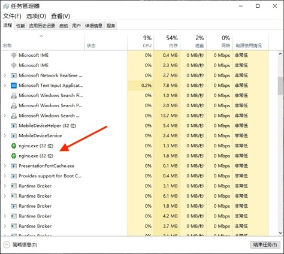

# IA5 车机应用市场破解

2021版，本教程以Windows电脑为例

## 破解

#### 准备

* 车
* 手机USB热点，或者能联网的智能路由器
* Windows电脑，或者mac电脑

### 搭建本地服务

0.下载懒人版并解压，跳过下面1、2、3步骤

1.下载Nginx[下载链接](http://nginx.org/en/download.html)，点击`Stable version`下面的`nginx/Windows-1.x.x`，并解压`zip`文件

2.在解压的目录里面新建文件夹`files`，把`via.apk`放到`files`文件夹里面

3.将以下内容粘贴到`conf/nginx.conf`最后一行花括号`}`的**前面**

```
    server {
        server_name appstore.gacicv.com;
        listen 80;

        location /files/via.apk {
            alias files/via.apk;
        }

        location /cas-vehicle-app/homepage/info {
            default_type application/json;
            return 200 '{"code":"0000","msg":null,"data":{"bannerList":[],"commendList":[],"cateList":null,"appPageList":{"pageNo":1,"pageSize":20,"totalCount":7,"pageCount":1,"list":[{"id":3,"categoryId":3,"categoryName":"音乐","appName":"via浏览器","appPackage":"mark.via","appProvider":"via","appDesc":"via浏览器","appIntro":"via浏览器","logoFileId":"20190320172316945TbRKmWRhHa","logoUrl":"http://appdownload.gacicv.com/group2/M00/00/00/CvhAWFySBoWAd41VAAAeNWfOsPU820.png","latestVersion":"4.3.0.8","downloads":28695,"installs":28744,"uninstalls":2134,"createTime":1553073801000,"updateTime":1601564574000,"vId":48,"pkgSize":528288,"pkgHash":"3b6632dfe34c488aeb5da29736963db903507fa921ec43b9902756bf667ec52c","pkgUrl":"https://appstore.gacicv.com/files/via.apk","verFlag":"4.3.0.8","verNum":4308,"releaseTime":1569859200000,"isPay":false,"buyPrice":null,"payStatus":null}]}},"success":true}';
        }

    }
```

4.双击nginx.exe，程序没有运行界面，用任务管理器查看是否正在运行



5.测试，在浏览器中打开[info链接](http://127.0.0.1/cas-vehicle-app/homepage/info)，是否有包含`via浏览器`的文本。打开[via.apk链接](http://127.0.0.1//files/via.apk)，能否下载via.apk

## 说明

#### 原理

车机应用市场[获取APP列表](https://appstore.gacicv.com/cas-vehicle-app/homepage/info)强制跳转至本地服务，并发送自定义APP列表

##### 关于2020版

**出游**APP的更新导致之前大神的破解方式失效
