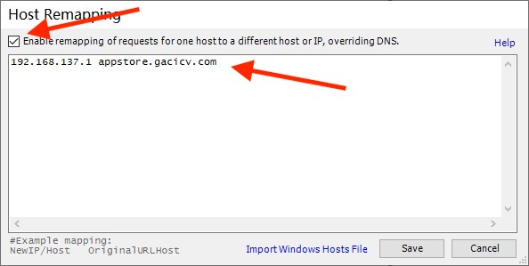

# IA5 车机应用市场破解

2021.01版，本教程以Windows为例，macOS同理

## 破解

### 准备

* 车
* 电脑
* 手机USB热点，或者能联网的智能路由器

### 搭建本地服务

1.[下载](files/nginx-1.18.0-lazy.zip)懒人版Nginx并解压，跳过下面1、2、3步骤

2.[下载](files/nginx-1.18.0.zip)Nginx并解压，或[官网链接](http://nginx.org/en/download.html)下载`Stable version`->`nginx/Windows-1.x.x`，

3.[下载](files/via.apk)旧版Via，在解压的Nginx目录里面新建文件夹`files`，把`via.apk`放到`files`文件夹里面

4.将以下内容粘贴到`conf/nginx.conf`最后一行花括号`}`的**前面**

```text
    server {
        server_name appstore.gacicv.com;
        listen 80;

        location /files/via.apk {
            alias files/via.apk;
        }

        location /cas-vehicle-app/homepage/info {
            default_type application/json;
            return 200 '{"code":"0000","msg":null,"data":{"bannerList":[],"commendList":[],"cateList":null,"appPageList":{"pageNo":1,"pageSize":20,"totalCount":7,"pageCount":1,"list":[{"id":3,"categoryId":3,"categoryName":"音乐","appName":"via浏览器","appPackage":"mark.via","appProvider":"via","appDesc":"via浏览器","appIntro":"via浏览器","logoFileId":"20190320172316945TbRKmWRhHa","logoUrl":"http://appdownload.gacicv.com/group2/M00/00/00/CvhAWFySBoWAd41VAAAeNWfOsPU820.png","latestVersion":"4.3.0.8","downloads":28695,"installs":28744,"uninstalls":2134,"createTime":1553073801000,"updateTime":1601564574000,"vId":48,"pkgSize":528288,"pkgHash":"3b6632dfe34c488aeb5da29736963db903507fa921ec43b9902756bf667ec52c","pkgUrl":"https://appstore.gacicv.com/files/via.apk","verFlag":"4.3.0.8","verNum":4308,"releaseTime":1569859200000,"isPay":false,"buyPrice":null,"payStatus":null}]}},"success":true}';
        }
    }
```

5.双击运行nginx.exe。程序没有界面，用任务管理器查看是否正在运行


6.测试，在浏览器中打开[应用市场APP列表本地链接](http://127.0.0.1/cas-vehicle-app/homepage/info)，网页包含`via浏览器`字样的文本。打开[via.apk本地链接](http://127.0.0.1/files/via.apk)，能否下载via.apk

### 搭建代理

#### 智能路由器方式

前提：车机Wi-Fi可以连接到家里智能路由器

1.自定义路由器Hosts，填入以下内容，其中`192.168.x.x`是局域网内运行Nginx电脑的ip

```text
192.168.x.x appstore.gacicv.com
```

2.测试，在浏览器中打开[应用市场APP列表链接](https://appstore.gacicv.com/cas-vehicle-app/homepage/info)。打开[via.apk链接](https://appstore.gacicv.com/files/via.apk)

#### 笔记本电脑方式

前提：手机通过USB热点共享网络给电脑，电脑开启Wi-Fi热点共享网络给车机(win10自带或猎豹wifi)

1.[下载](files/FiddlerSetup.exe)Fiddler并安装打开 ，或[官网下载](https://www.telerik.com/fiddler)

2.修改Hosts，点击`Tool`->`HOSTS`，勾选`enable remapping...`，填入以下内容，其中`192.168.x.1`是电脑Wi-Fi热点的ip

```text
192.168.x.1 appstore.gacicv.com
```



3.开启代理，点击`Tools`->`Fiddler Options`->`Connections`，勾选`Allow remote computers to connect`


4.重启Fiddler

5.用第二部手机连接电脑代理，同下面车机操作。测试，在手机浏览器中打开[应用市场APP列表链接](https://appstore.gacicv.com/cas-vehicle-app/homepage/info)。打开[via.apk链接](https://appstore.gacicv.com/files/via.apk)

### 车机应用市场破解

1.打开车机Wi-Fi，连接电脑热点

2.`系统设置`->`车辆信息`(**长按**10秒以上)->`WLAN`->电脑热点->`高级选项`->`代理`->`手动`

3.`代理服务器主机名`填`192.168.x.1`电脑Wi-Fi热点的ip。`代理服务器端口`填`8888`，保存


4.打开应用市场，刷新，安装Via，完成

## 说明

### 原理

车机应用市场[APP列表](https://appstore.gacicv.com/cas-vehicle-app/homepage/info)强制跳转至本地服务，发送自定义APP列表

### 关于2020版

**出游**APP的更新导致之前大神的破解方式失效
